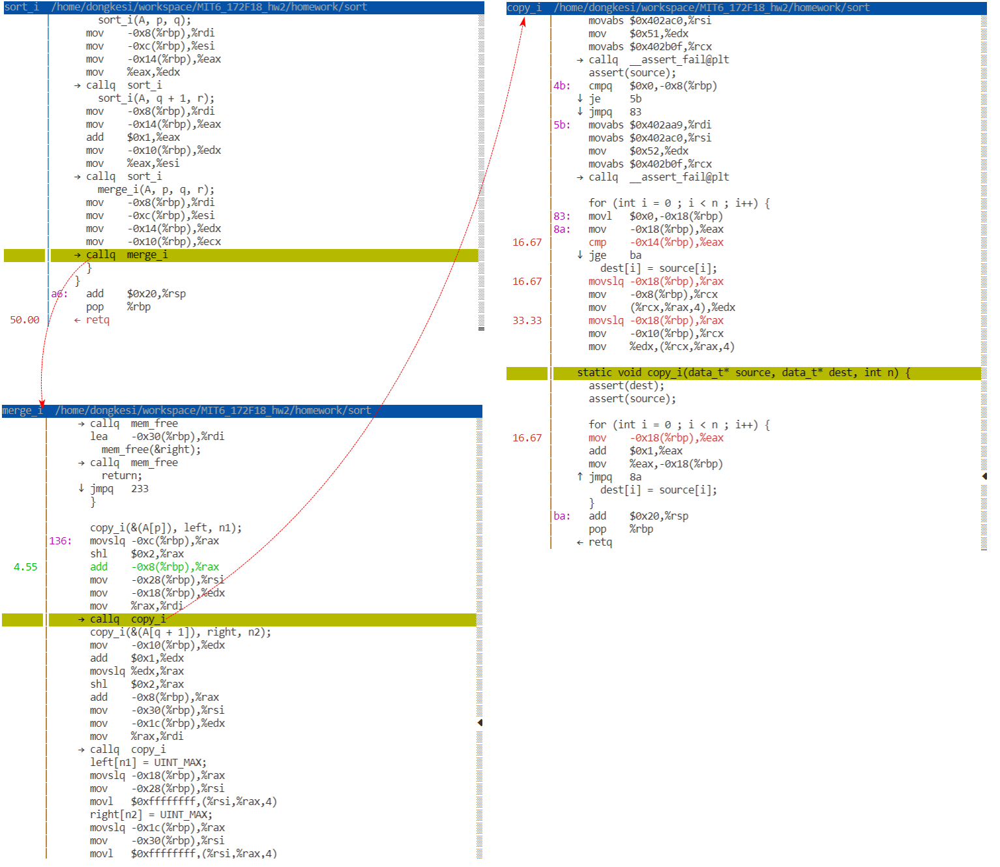

# Good Resources
- [ ] [Bentley's Rules](http://www.new-npac.org/projects/cdroms/cewes-1999-06-vol1/nhse/hpccsurvey/orgs/sgi/bentley.html#procedure0)
- [ ] [sillycross/Leiserchess---MIT-6.172-Fall16-Final-Project](https://github.com/sillycross/Leiserchess---MIT-6.172-Fall16-Final-Project)
- [ ] [Bit Twiddling Hacks](http://graphics.stanford.edu/~seander/bithacks.html)

# Homework 2: Profiling Serial Merge Sort
- Tools
  - Perf: 可以看程序花费了多长时间
  - Cachegrind: Valgrind工具套件中的Cache和分支预测剖析工具

## 2.1 Perf

`perf`是用于基于Linux 2.6+系统的性能剖析工具。它**使用采样**来收集有关重要**软件，内核和硬件事件**的数据，以便定位程序中的性能瓶颈。 它将生成详细的时间记录在代码中的时间。

注意：如果您的AWS VM上未安装perf，请运行
```
$ sudo apt install linux-tools-common linux-tools-aws 
```

您可以使用`perf record`和`perf report`来分析程序的性能。`perf record`会生成运行代码时发生的事件的记录，`perf report`可让您以交互方式查看它。

注意：为了使`perf`正确注释您的代码，在编译程序时必须将`-g`标志传递给`clang`。该标志**不会影响性能**，它告诉编译器**生成调试符号**，该调试符号使perf和gdb等工具可以将机器代码行与源代码行关联起来。如果使用`DEBUG=1`运行提供的Makefile，它将执行此操作。

要在程序上记录性能事件，请运行以下命令：
```
$ perf record <program_name> <program_arguments> 
```
然后，您可以通过从同一目录运行`perf report`来查看结果：
```
$ perf report 
```
【注：WSL 不支持perf】

识别分支未命中，时钟周期和指令。 诊断程序中的性能瓶颈。

### Checkoff Item 1: 
Make note of one bottleneck. 

#### Output
- 编译诊断
```
$ make isort DEBUG=1 
$ sudo perf record ./isort 10000 10
Sorting 10000 values...
Done!
[ perf record: Woken up 1 times to write data ]
[ perf record: Captured and wrote 0.037 MB perf.data (683 samples) ]
```
- 诊断输出
```
Samples: 683  of event 'cpu-clock', Event count (approx.): 170750000
Overhead  Command  Shared Object      Symbol
  99.12%  isort    isort              [.] isort
   0.29%  isort    [kernel.kallsyms]  [k] finish_task_switch
   0.15%  isort    [e1000]            [k] e1000_alloc_rx_buffers
   0.15%  isort    [kernel.kallsyms]  [k] __softirqentry_text_start
   0.15%  isort    [kernel.kallsyms]  [k] e1000_alloc_rx_buffers
   0.15%  isort    libc-2.23.so       [.] rand_r
```

```c
isort  /home/dongkesi/workspace/MIT6_172F18_hw2/recitation/isort
       │                                                                                                                                                                                                               ◆
       │                                                                                                                                                                                                               ▒
       │                                                                                                                                                                                                               ▒
       │    Disassembly of section .text:                                                                                                                                                                              ▒
       │                                                                                                                                                                                                               ▒
       │    0000000000400740 <isort>:                                                                                                                                                                                  ▒
       │    isort():                                                                                                                                                                                                   ▒
       │    typedef uint32_t data_t;                                                                                                                                                                                   ▒
       │                                                                                                                                                                                                               ▒
       │    extern void quickSortIterative(data_t arr[], int l, int h);                                                                                                                                                ▒
       │                                                                                                                                                                                                               ▒
       │    /* Insertion sort */                                                                                                                                                                                       ▒
       │    void isort(data_t* left, data_t* right) {                                                                                                                                                                  ▒
       │      push   %rbp                                                                                                                                                                                              ▒
       │      mov    %rsp,%rbp                                                                                                                                                                                         ▒
       │      mov    %rdi,-0x8(%rbp)                                                                                                                                                                                   ▒
       │      mov    %rsi,-0x10(%rbp)                                                                                                                                                                                  ▒
       │      data_t* cur = left + 1;                                                                                                                                                                                  ▒
       │      mov    -0x8(%rbp),%rsi                                                                                                                                                                                   ▒
       │      add    $0x4,%rsi                                                                                                                                                                                         ▒
       │      mov    %rsi,-0x18(%rbp)                                                                                                                                                                                  ▒
       │      while (cur <= right) {                                                                                                                                                                                   ▒
       │18:   mov    -0x18(%rbp),%rax                                                                                                                                                                                  ▒
       │      cmp    -0x10(%rbp),%rax                                                                                                                                                                                  ▒
       │    ↓ ja     a8                                                                                                                                                                                                ▒
       │        data_t val = *cur;                                                                                                                                                                                     ▒
       │      mov    -0x18(%rbp),%rax                                                                                                                                                                                  ▒
       │      mov    (%rax),%ecx                                                                                                                                                                                       ▒
  0.30 │      mov    %ecx,-0x1c(%rbp)                                                                                                                                                                                  ▒
       │        data_t* index = cur - 1;                                                                                                                                                                               ▒
       │      mov    -0x18(%rbp),%rax                                                                                                                                                                                  ▒
       │      add    $0xfffffffffffffffc,%rax                                                                                                                                                                          ▒
       │      mov    %rax,-0x28(%rbp)                                                                                                                                                                                  ▒
  8.57 │3b:   xor    %eax,%eax                                                                                                                                                                                         ▒
       │      mov    %al,%cl                                                                                                                                                                                           ▒
       │                                                                                                                                                                                                               ▒
       │        while (index >= left && *index > val) {                                                                                                                                                                ▒
  4.28 │      mov    -0x28(%rbp),%rdx                                                                                                                                                                                  ▒
  0.15 │      cmp    -0x8(%rbp),%rdx                                                                                                                                                                                   ▒
 11.23 │      mov    %cl,-0x29(%rbp)                                                                                                                                                                                   ▒
       │    ↓ jb     5f                                                                                                                                                                                                ▒
  3.84 │      mov    -0x28(%rbp),%rax                                                                                                                                                                                  ▒
       │      mov    (%rax),%ecx                                                                                                                                                                                       ▒
  9.75 │      cmp    -0x1c(%rbp),%ecx                                                                                                                                                                                  ▒
  0.74 │      seta   %dl                                                                                                                                                                                               ▒
  6.94 │      mov    %dl,-0x29(%rbp)                                                                                                                                                                                   ▒
 10.04 │5f:   mov    -0x29(%rbp),%al                                                                                                                                                                                   ▒
 16.25 │      test   $0x1,%al                                                                                                                                                                                          ▒
       │    ↓ jne    6f                                                                                                                                                                                                ▒
  0.30 │    ↓ jmpq   8d  
       │          *(index + 1) = *index;                                                                                                                                                                               ▒
 10.04 │6f:   mov    -0x28(%rbp),%rax                                                                                                                                                                                  ▒
       │      mov    (%rax),%ecx                                                                                                                                                                                       ▒
  3.25 │      mov    -0x28(%rbp),%rax                                                                                                                                                                                  ▒
       │      mov    %ecx,0x4(%rax)                                                                                                                                                                                    ▒
       │          index--;                                                                                                                                                                                             ▒
 10.64 │      mov    -0x28(%rbp),%rax                                                                                                                                                                                  ▒
       │      add    $0xfffffffffffffffc,%rax                                                                                                                                                                          ▒
  3.69 │      mov    %rax,-0x28(%rbp)                                                                                                                                                                                  ▒
       │      data_t* cur = left + 1;                                                                                                                                                                                  ▒
       │      while (cur <= right) {                                                                                                                                                                                   ▒
       │        data_t val = *cur;                                                                                                                                                                                     ▒
       │        data_t* index = cur - 1;                                                                                                                                                                               ▒
       │                                                                                                                                                                                                               ▒
       │        while (index >= left && *index > val) {                                                                                                                                                                ▒
       │    ↑ jmpq   3b                                                                                                                                                                                                ▒
       │          *(index + 1) = *index;                                                                                                                                                                               ▒
       │          index--;                                                                                                                                                                                             ▒
       │        }                                                                                                                                                                                                      ▒
       │                                                                                                                                                                                                               ▒
       │        *(index + 1) = val;                                                                                                                                                                                    ▒
       │8d:   mov    -0x1c(%rbp),%eax                                                                                                                                                                                  ▒
       │      mov    -0x28(%rbp),%rcx                                                                                                                                                                                  ▒
       │      mov    %eax,0x4(%rcx)                                                                                                                                                                                    ▒
       │        cur++;                                                                                                                                                                                                 ▒
       │      mov    -0x18(%rbp),%rcx                                                                                                                                                                                  ▒
       │      add    $0x4,%rcx                                                                                                                                                                                         ▒
       │      mov    %rcx,-0x18(%rbp)                                                                                                                                                                                  ▒
       │    extern void quickSortIterative(data_t arr[], int l, int h);                                                                                                                                                ▒
       │                                                                                                                                                                                                               ▒
       │    /* Insertion sort */                                                                                                                                                                                       ▒
       │    void isort(data_t* left, data_t* right) {                                                                                                                                                                  ▒
       │      data_t* cur = left + 1;                                                                                                                                                                                  ▒
       │      while (cur <= right) {                                                                                                                                                                                   ▒
       │    ↑ jmpq   18                                                                                                                                                                                                ▒
       │        }                                                                                                                                                                                                      ▒
       │                                                                                                                                                                                                               ▒
       │        *(index + 1) = val;                                                                                                                                                                                    ▒
       │        cur++;                                                                                                                                                                                                 ▒
       │      }                                                                                                                                                                                                        ▒
       │    }                                                                                                                                                                                                          ▒
       │a8:   pop    %rbp                                                                                                                                                                                              ▒
       │    ← retq                                                                                                       
```


## 2.2 Cachegrind 

Cachegrind（Valgrind工具）是一个缓存和分支预测配置文件。从类中回想起，从L1缓存读取的速度可能比从RAM读取的速度快100倍！优化缓存命中是性能工程的关键部分。

在类似于AWS的虚拟环境上，提供有关分支和缓存未命中信息的**硬件事件通常不可用**，因此性能可能无济于事。Cachegrind**模拟您的程序如何与计算机的缓存层次结构和分支预测器交互，并且即使在没有可用的硬件性能计数器的情况下也可以使用**。

这是有关如何识别缓存未命中，分支未命中，时钟周期以及程序使用Cachegrind执行的指令的示例：
```
$ valgrind --tool=cachegrind --branch-sim=yes <program_name> <program_arguments> 
```
注意：尽管`valgrind --tool=cachegrind`使用模拟器来测量高速缓存和分支预测器的行为，但是它的模拟基于运行它的体系结构。当您在不同的计算机上运行时，您应该期望获得不同的结果，例如 在您的个人实例与awsrun计算机上运行时。

文件`sum.c`包含一个程序，该程序分配`U = 10 million`个元素的数组，然后对`N = 100 million`个随机选择的元素求和。

### Checkoff Item 2: 

Run `sum` under `cachegrind` to identify cache performance. It may take a little while. In the output, look at the D1 and LLd misses. 
- **D1** represents the **lowest-level cache (L1)**, and 
- **LL** represents the **last (highest) level data cache (on most machines, L3)**. 

Do these numbers correspond with what you would expect? Try playing around with the values N and U in sum.c. How can you bring down the number of cache misses? 

- 提示:要查找关于您的CPU及其缓存的信息，请使用`lscpu`。
- 检查(Checkoff):向助教解释你对前两项检查的响应。
#### Code
- sum.c
```c
// Copyright (c) 2012 MIT License by 6.172 Staff

#include <stdio.h>
#include <stdint.h>
#include <stdlib.h>

typedef uint32_t data_t;
const int U = 10000000;   // size of the array. 10 million vals ~= 40MB
const int N = 100000000;  // number of searches to perform

int main() {
  data_t* data = (data_t*) malloc(U * sizeof(data_t));
  if (data == NULL) {
    free(data);
    printf("Error: not enough memory\n");
    exit(-1);
  }

  // fill up the array with sequential (sorted) values.
  int i;
  for (i = 0; i < U; i++) {
    data[i] = i;
  }

  printf("Allocated array of size %d\n", U);
  printf("Summing %d random values...\n", N);

  data_t val = 0;
  data_t seed = 42;
  for (i = 0; i < N; i++) {
    int l = rand_r(&seed) % U;
    val = (val + data[l]);
  }

  free(data);
  printf("Done. Value = %d\n", val);
  return 0;
}
```
#### Output
```c
# 编译
$ make sum
# 剖析
$ valgrind --tool=cachegrind --branch-sim=yes ./sum 
==11758== Cachegrind, a cache and branch-prediction profiler
==11758== Copyright (C) 2002-2015, and GNU GPL'd, by Nicholas Nethercote et al.
==11758== Using Valgrind-3.11.0 and LibVEX; rerun with -h for copyright info
==11758== Command: ./sum
==11758== 
--11758-- warning: L3 cache found, using its data for the LL simulation.
Allocated array of size 10000000
Summing 100000000 random values...
Done. Value = 938895920
==11758== 
==11758== I   refs:      3,740,218,245
==11758== I1  misses:            1,077
==11758== LLi misses:            1,067
==11758== I1  miss rate:          0.00%
==11758== LLi miss rate:          0.00%
==11758== 
==11758== D   refs:        610,073,079  (400,055,269 rd   + 210,017,810 wr)
==11758== D1  misses:      100,548,041  ( 99,922,250 rd   +     625,791 wr)
==11758== LLd misses:       79,732,200  ( 79,106,451 rd   +     625,749 wr)
==11758== D1  miss rate:          16.5% (       25.0%     +         0.3%  )
==11758== LLd miss rate:          13.1% (       19.8%     +         0.3%  )
==11758== 
==11758== LL refs:         100,549,118  ( 99,923,327 rd   +     625,791 wr)
==11758== LL misses:        79,733,267  ( 79,107,518 rd   +     625,749 wr)
==11758== LL miss rate:            1.8% (        1.9%     +         0.3%  )
==11758== 
==11758== Branches:        210,040,250  (110,039,652 cond + 100,000,598 ind)
==11758== Mispredicts:           5,201  (      4,990 cond +         211 ind)
==11758== Mispred rate:            0.0% (        0.0%     +         0.0%   )
```
#### CPU 参数

```c
$ lscpu
Architecture:          x86_64
CPU op-mode(s):        32-bit, 64-bit
Byte Order:            Little Endian
CPU(s):                1
On-line CPU(s) list:   0
Thread(s) per core:    1
Core(s) per socket:    1
Socket(s):             1
NUMA node(s):          1
Vendor ID:             GenuineIntel
CPU family:            6
Model:                 142
Model name:            Intel(R) Core(TM) i7-8550U CPU @ 1.80GHz
Stepping:              10
CPU MHz:               1992.000
BogoMIPS:              3984.00
Hypervisor vendor:     KVM
Virtualization type:   full
L1d cache:             32K
L1i cache:             32K
L2 cache:              256K
L3 cache:              8192K
NUMA node0 CPU(s):     0
Flags:                 fpu vme de pse tsc msr pae mce cx8 apic sep mtrr pge mca cmov pat pse36 clflush mmx fxsr sse sse2 syscall nx rdtscp lm constant_tsc rep_good nopl xtopology nonstop_tsc eagerfpu pni pclmulqdq monitor ssse3 cx16 pcid sse4_1 sse4_2 x2apic movbe popcnt aes xsave avx rdrand hypervisor lahf_lm abm 3dnowprefetch fsgsbase avx2 invpcid rdseed clflushopt
```
- cg_annotate
```
$ cg_annotate cachegrind.out.12202 
--------------------------------------------------------------------------------
I1 cache:         32768 B, 64 B, 8-way associative
D1 cache:         32768 B, 64 B, 8-way associative
LL cache:         8388608 B, 64 B, 16-way associative
Command:          ./sum
Data file:        cachegrind.out.12202
Events recorded:  Ir I1mr ILmr Dr D1mr DLmr Dw D1mw DLmw Bc Bcm Bi Bim
Events shown:     Ir I1mr ILmr Dr D1mr DLmr Dw D1mw DLmw Bc Bcm Bi Bim
Event sort order: Ir I1mr ILmr Dr D1mr DLmr Dw D1mw DLmw Bc Bcm Bi Bim
Thresholds:       0.1 100 100 100 100 100 100 100 100 100 100 100 100
Include dirs:     
User annotated:   
Auto-annotation:  off

--------------------------------------------------------------------------------
           Ir  I1mr  ILmr          Dr       D1mr       DLmr          Dw    D1mw    DLmw          Bc   Bcm          Bi Bim 
--------------------------------------------------------------------------------
3,740,218,245 1,077 1,067 400,055,269 99,922,250 79,106,451 210,017,810 625,791 625,749 110,039,652 4,990 100,000,598 211  PROGRAM TOTALS

--------------------------------------------------------------------------------
           Ir I1mr ILmr          Dr       D1mr       DLmr          Dw    D1mw    DLmw          Bc   Bcm          Bi Bim  file:function
--------------------------------------------------------------------------------
2,200,000,000    3    3 200,000,000          0          0 100,000,000       0       0           0     0           0   0  /build/glibc-Cl5G7W/glibc-2.23/stdlib/rand_r.c:rand_r
1,440,000,038    3    3 100,000,005 99,919,284 79,104,021 110,000,011 625,002 625,002 110,000,001    20           0   0  ???:main
  100,000,326   41   39 100,000,161         18         10          45       1       1          22    11 100,000,101  24  ???:???
```
#### 分析
- Write
  > 代码中是按顺序写，所以Cache命中率会很高，即Cache Miss率很低。从数据来看D1与LLd miss rate差不多。
  ```c
  // fill up the array with sequential (sorted) values.
  int i;
  for (i = 0; i < U; i++) {
    data[i] = i;
  }
  ```
- Read
  > 相对来说，读内存是随机的，所以Cache Miss Rate有点高，是需要下一步要解决的读的问题。
  ```c
  for (i = 0; i < N; i++) {
    int l = rand_r(&seed) % U;
    val = (val + data[l]);
  }
  ```
#### N不变，递减U

- Case 1：分析来看，如果U，即分配数组的大小在L3之内，那么不管N为多大，性能会有巨大提升，让我们先试着把U减少到能使L3容纳下。L3为8MB，data大小目前为10million, 占用40MB，把U降到2million看一下。
```c
U=2,000,000; N=100,000,000
$ valgrind --tool=cachegrind --branch-sim=yes ./sum 
==12891== Cachegrind, a cache and branch-prediction profiler
==12891== Copyright (C) 2002-2015, and GNU GPL'd, by Nicholas Nethercote et al.
==12891== Using Valgrind-3.11.0 and LibVEX; rerun with -h for copyright info
==12891== Command: ./sum
==12891== 
--12891-- warning: L3 cache found, using its data for the LL simulation.
Allocated array of size 2000000
Summing 100000000 random values...
Done. Value = -1039557200
==12891== 
==12891== I   refs:      3,708,218,311
==12891== I1  misses:            1,081
==12891== LLi misses:            1,071
==12891== I1  miss rate:          0.00%
==12891== LLi miss rate:          0.00%
==12891== 
==12891== D   refs:        602,073,109  (400,055,286 rd   + 202,017,823 wr)
==12891== D1  misses:       99,720,598  ( 99,594,807 rd   +     125,791 wr)
==12891== LLd misses:          128,428  (      2,726 rd   +     125,702 wr)
==12891== D1  miss rate:          16.6% (       24.9%     +         0.1%  )
==12891== LLd miss rate:           0.0% (        0.0%     +         0.1%  )
==12891== 
==12891== LL refs:          99,721,679  ( 99,595,888 rd   +     125,791 wr)
==12891== LL misses:           129,499  (      3,797 rd   +     125,702 wr)
==12891== LL miss rate:            0.0% (        0.0%     +         0.1%  )
==12891== 
==12891== Branches:        202,040,261  (102,039,662 cond + 100,000,599 ind)
==12891== Mispredicts:           5,218  (      5,006 cond +         212 ind)
==12891== Mispred rate:            0.0% (        0.0%     +         0.0%   )
```
> 可以看到LLD miss rate接近0
- Case 2: 如果U的数量下降到能被L1 cache容纳下，那么D1 miss rate也会下降，让我们试试看 L1 Cache size为32KB，可以容纳8KB数据。

```c
U=8,192; N=100,000,000
$ valgrind --tool=cachegrind --branch-sim=yes ./sum 
==12916== Cachegrind, a cache and branch-prediction profiler
==12916== Copyright (C) 2002-2015, and GNU GPL'd, by Nicholas Nethercote et al.
==12916== Using Valgrind-3.11.0 and LibVEX; rerun with -h for copyright info
==12916== Command: ./sum
==12916== 
--12916-- warning: L3 cache found, using its data for the LL simulation.
Allocated array of size 8192
Summing 100000000 random values...
Done. Value = 1528033584
==12916== 
==12916== I   refs:      3,500,250,947
==12916== I1  misses:            1,080
==12916== LLi misses:            1,063
==12916== I1  miss rate:          0.00%
==12916== LLi miss rate:          0.00%
==12916== 
==12916== D   refs:        600,081,256  (400,055,253 rd   + 200,026,003 wr)
==12916== D1  misses:          679,381  (    678,080 rd   +       1,301 wr)
==12916== LLd misses:            3,382  (      2,188 rd   +       1,194 wr)
==12916== D1  miss rate:           0.1% (        0.2%     +         0.0%  )
==12916== LLd miss rate:           0.0% (        0.0%     +         0.0%  )
==12916== 
==12916== LL refs:             680,461  (    679,160 rd   +       1,301 wr)
==12916== LL misses:             4,445  (      3,251 rd   +       1,194 wr)
==12916== LL miss rate:            0.0% (        0.0%     +         0.0%  )
==12916== 
==12916== Branches:        200,048,437  (100,047,839 cond + 100,000,598 ind)
==12916== Mispredicts:           5,203  (      4,992 cond +         211 ind)
==12916== Mispred rate:            0.0% (        0.0%     +         0.0%   )
```
> 确实如我们所想，`D1  miss rate`下降很多，但是程序中有其它变量，以至于偶尔换进换出会影响命中率。

- Case 3: 使用比L1 Cache大小稍微小点的U，以容纳程序中的其它变量
```c
U=8,000; N=100,000,000
$ valgrind --tool=cachegrind --branch-sim=yes ./sum 
==12933== Cachegrind, a cache and branch-prediction profiler
==12933== Copyright (C) 2002-2015, and GNU GPL'd, by Nicholas Nethercote et al.
==12933== Using Valgrind-3.11.0 and LibVEX; rerun with -h for copyright info
==12933== Command: ./sum
==12933== 
--12933-- warning: L3 cache found, using its data for the LL simulation.
Allocated array of size 8000
Summing 100000000 random values...
Done. Value = 499751856
==12933== 
==12933== I   refs:      3,700,250,162
==12933== I1  misses:            1,080
==12933== LLi misses:            1,063
==12933== I1  miss rate:          0.00%
==12933== LLi miss rate:          0.00%
==12933== 
==12933== D   refs:        600,081,061  (400,055,251 rd   + 200,025,810 wr)
==12933== D1  misses:          593,734  (    592,447 rd   +       1,287 wr)
==12933== LLd misses:            3,370  (      2,188 rd   +       1,182 wr)
==12933== D1  miss rate:           0.1% (        0.1%     +         0.0%  )
==12933== LLd miss rate:           0.0% (        0.0%     +         0.0%  )
==12933== 
==12933== LL refs:             594,814  (    593,527 rd   +       1,287 wr)
==12933== LL misses:             4,433  (      3,251 rd   +       1,182 wr)
==12933== LL miss rate:            0.0% (        0.0%     +         0.0%  )
==12933== 
==12933== Branches:        200,048,242  (100,047,644 cond + 100,000,598 ind)
==12933== Mispredicts:           5,204  (      4,993 cond +         211 ind)
==12933== Mispred rate:            0.0% (        0.0%     +         0.0%   )
```
> 有下降，不过只下降了一半，是不是多线程环境，导致进程切换从而使Cache换出了呢？

- Case 4: 进一步减小 U

```c
U=4,096; N=100,000,000
$ valgrind --tool=cachegrind --branch-sim=yes ./sum 
==12953== Cachegrind, a cache and branch-prediction profiler
==12953== Copyright (C) 2002-2015, and GNU GPL'd, by Nicholas Nethercote et al.
==12953== Using Valgrind-3.11.0 and LibVEX; rerun with -h for copyright info
==12953== Command: ./sum
==12953== 
--12953-- warning: L3 cache found, using its data for the LL simulation.
Allocated array of size 4096
Summing 100000000 random values...
Done. Value = -1409031888
==12953== 
==12953== I   refs:      3,500,234,617
==12953== I1  misses:            1,084
==12953== LLi misses:            1,067
==12953== I1  miss rate:          0.00%
==12953== LLi miss rate:          0.00%
==12953== 
==12953== D   refs:        600,077,184  (400,055,268 rd   + 200,021,916 wr)
==12953== D1  misses:            3,888  (      2,877 rd   +       1,011 wr)
==12953== LLd misses:            3,126  (      2,188 rd   +         938 wr)
==12953== D1  miss rate:           0.0% (        0.0%     +         0.0%  )
==12953== LLd miss rate:           0.0% (        0.0%     +         0.0%  )
==12953== 
==12953== LL refs:               4,972  (      3,961 rd   +       1,011 wr)
==12953== LL misses:             4,193  (      3,255 rd   +         938 wr)
==12953== LL miss rate:            0.0% (        0.0%     +         0.0%  )
==12953== 
==12953== Branches:        200,044,352  (100,043,753 cond + 100,000,599 ind)
==12953== Mispredicts:           5,216  (      5,004 cond +         212 ind)
==12953== Mispred rate:            0.0% (        0.0%     +         0.0%   )
```
> 看到了吗？`D1  miss rate:`进一步下降，考虑到其与`LLd miss rate:`已经接近，认为这里进一步减小U，已经没有提升空间，为了验证猜想，可以继续试试更小的。
- Case 5: 进一步减小U
```c
U=64; N=100,000,000
$ valgrind --tool=cachegrind --branch-sim=yes ./sum 
==12980== Cachegrind, a cache and branch-prediction profiler
==12980== Copyright (C) 2002-2015, and GNU GPL'd, by Nicholas Nethercote et al.
==12980== Using Valgrind-3.11.0 and LibVEX; rerun with -h for copyright info
==12980== Command: ./sum
==12980== 
--12980-- warning: L3 cache found, using its data for the LL simulation.
Allocated array of size 64
Summing 100000000 random values...
Done. Value = -1144934928
==12980== 
==12980== I   refs:      3,500,218,456
==12980== I1  misses:            1,082
==12980== LLi misses:            1,065
==12980== I1  miss rate:          0.00%
==12980== LLi miss rate:          0.00%
==12980== 
==12980== D   refs:        600,073,145  (400,055,265 rd   + 200,017,880 wr)
==12980== D1  misses:            3,621  (      2,863 rd   +         758 wr)
==12980== LLd misses:            2,874  (      2,189 rd   +         685 wr)
==12980== D1  miss rate:           0.0% (        0.0%     +         0.0%  )
==12980== LLd miss rate:           0.0% (        0.0%     +         0.0%  )
==12980== 
==12980== LL refs:               4,703  (      3,945 rd   +         758 wr)
==12980== LL misses:             3,939  (      3,254 rd   +         685 wr)
==12980== LL miss rate:            0.0% (        0.0%     +         0.0%  )
==12980== 
==12980== Branches:        200,040,316  (100,039,717 cond + 100,000,599 ind)
==12980== Mispredicts:           5,214  (      5,002 cond +         212 ind)
==12980== Mispred rate:            0.0% (        0.0%     +         0.0%   )
```
> 看到了吗？与Case 4没太大差别。

综上所述，当data完全可以放进Cache中时，cache miss rate显著降低，但是考虑到多进程和其它变量缘故，使用适当更小的data size更好的利用cache，从而减少cache miss

那么N有什么影响？N只是反复的读，**当data不能完全装入cache时，更少的随机读，意味着更低概率的cache miss**。

##### U不变，递减N，Cache容不下U
- U=10,000,000; N=100,000,000
```c
$ valgrind --tool=cachegrind --branch-sim=yes ./sum 
==13080== Cachegrind, a cache and branch-prediction profiler
==13080== Copyright (C) 2002-2015, and GNU GPL'd, by Nicholas Nethercote et al.
==13080== Using Valgrind-3.11.0 and LibVEX; rerun with -h for copyright info
==13080== Command: ./sum
==13080== 
--13080-- warning: L3 cache found, using its data for the LL simulation.
Allocated array of size 10000000
Summing 100000000 random values...
Done. Value = 938895920
==13080== 
==13080== I   refs:      3,740,218,245
==13080== I1  misses:            1,077
==13080== LLi misses:            1,067
==13080== I1  miss rate:          0.00%
==13080== LLi miss rate:          0.00%
==13080== 
==13080== D   refs:        610,073,079  (400,055,269 rd   + 210,017,810 wr)
==13080== D1  misses:      100,548,041  ( 99,922,250 rd   +     625,791 wr)
==13080== LLd misses:       79,732,200  ( 79,106,451 rd   +     625,749 wr)
==13080== D1  miss rate:          16.5% (       25.0%     +         0.3%  )
==13080== LLd miss rate:          13.1% (       19.8%     +         0.3%  )
==13080== 
==13080== LL refs:         100,549,118  ( 99,923,327 rd   +     625,791 wr)
==13080== LL misses:        79,733,267  ( 79,107,518 rd   +     625,749 wr)
==13080== LL miss rate:            1.8% (        1.9%     +         0.3%  )
==13080== 
==13080== Branches:        210,040,250  (110,039,652 cond + 100,000,598 ind)
==13080== Mispredicts:           5,201  (      4,990 cond +         211 ind)
==13080== Mispred rate:            0.0% (        0.0%     +         0.0%   )
```
- U=10,000,000; N=10,000,000
```c
$ valgrind --tool=cachegrind --branch-sim=yes ./sum 
==13068== Cachegrind, a cache and branch-prediction profiler
==13068== Copyright (C) 2002-2015, and GNU GPL'd, by Nicholas Nethercote et al.
==13068== Using Valgrind-3.11.0 and LibVEX; rerun with -h for copyright info
==13068== Command: ./sum
==13068== 
--13068-- warning: L3 cache found, using its data for the LL simulation.
Allocated array of size 10000000
Summing 10000000 random values...
Done. Value = 2001765130
==13068== 
==13068== I   refs:      410,218,241
==13068== I1  misses:          1,077
==13068== LLi misses:          1,067
==13068== I1  miss rate:        0.00%
==13068== LLi miss rate:        0.00%
==13068== 
==13068== D   refs:       70,073,077  (40,055,268 rd   + 30,017,809 wr)
==13068== D1  misses:     10,620,599  ( 9,994,808 rd   +    625,791 wr)
==13068== LLd misses:      8,539,458  ( 7,913,709 rd   +    625,749 wr)
==13068== D1  miss rate:        15.2% (      25.0%     +        2.1%  )
==13068== LLd miss rate:        12.2% (      19.8%     +        2.1%  )
==13068== 
==13068== LL refs:        10,621,676  ( 9,995,885 rd   +    625,791 wr)
==13068== LL misses:       8,540,525  ( 7,914,776 rd   +    625,749 wr)
==13068== LL miss rate:          1.8% (       1.8%     +        2.1%  )
==13068== 
==13068== Branches:       30,040,250  (20,039,652 cond + 10,000,598 ind)
==13068== Mispredicts:         5,197  (     4,986 cond +        211 ind)
==13068== Mispred rate:          0.0% (       0.0%     +        0.0%   )
```
- U=10,000,000; N=1,000,000
```c
$ valgrind --tool=cachegrind --branch-sim=yes ./sum 
==13062== Cachegrind, a cache and branch-prediction profiler
==13062== Copyright (C) 2002-2015, and GNU GPL'd, by Nicholas Nethercote et al.
==13062== Using Valgrind-3.11.0 and LibVEX; rerun with -h for copyright info
==13062== Command: ./sum
==13062== 
--13062-- warning: L3 cache found, using its data for the LL simulation.
Allocated array of size 10000000
Summing 1000000 random values...
Done. Value = 757741929
==13062== 
==13062== I   refs:      77,218,214
==13062== I1  misses:         1,077
==13062== LLi misses:         1,067
==13062== I1  miss rate:       0.00%
==13062== LLi miss rate:       0.00%
==13062== 
==13062== D   refs:      16,073,075  ( 4,055,266 rd   + 12,017,809 wr)
==13062== D1  misses:     1,627,935  ( 1,002,144 rd   +    625,791 wr)
==13062== LLd misses:     1,418,581  (   792,832 rd   +    625,749 wr)
==13062== D1  miss rate:       10.1% (      24.7%     +        5.2%  )
==13062== LLd miss rate:        8.8% (      19.6%     +        5.2%  )
==13062== 
==13062== LL refs:        1,629,012  ( 1,003,221 rd   +    625,791 wr)
==13062== LL misses:      1,419,648  (   793,899 rd   +    625,749 wr)
==13062== LL miss rate:         1.5% (       1.0%     +        5.2%  )
==13062== 
==13062== Branches:      12,040,244  (11,039,646 cond +  1,000,598 ind)
==13062== Mispredicts:        5,202  (     4,991 cond +        211 ind)
==13062== Mispred rate:         0.0% (       0.0%     +        0.0%   )
```
- U=10,000,000; N=100,000
```c
$ valgrind --tool=cachegrind --branch-sim=yes ./sum 
==13098== Cachegrind, a cache and branch-prediction profiler
==13098== Copyright (C) 2002-2015, and GNU GPL'd, by Nicholas Nethercote et al.
==13098== Using Valgrind-3.11.0 and LibVEX; rerun with -h for copyright info
==13098== Command: ./sum
==13098== 
--13098-- warning: L3 cache found, using its data for the LL simulation.
Allocated array of size 10000000
Summing 100000 random values...
Done. Value = 255943066
==13098== 
==13098== I   refs:      43,918,193
==13098== I1  misses:         1,077
==13098== LLi misses:         1,067
==13098== I1  miss rate:       0.00%
==13098== LLi miss rate:       0.00%
==13098== 
==13098== D   refs:      10,673,070  (   455,263 rd   + 10,217,807 wr)
==13098== D1  misses:       728,684  (   102,893 rd   +    625,791 wr)
==13098== LLd misses:       707,187  (    81,458 rd   +    625,729 wr)
==13098== D1  miss rate:        6.8% (      22.6%     +        6.1%  )
==13098== LLd miss rate:        6.6% (      17.9%     +        6.1%  )
==13098== 
==13098== LL refs:          729,761  (   103,970 rd   +    625,791 wr)
==13098== LL misses:        708,254  (    82,525 rd   +    625,729 wr)
==13098== LL miss rate:         1.3% (       0.2%     +        6.1%  )
==13098== 
==13098== Branches:      10,240,241  (10,139,643 cond +    100,598 ind)
==13098== Mispredicts:        5,202  (     4,991 cond +        211 ind)
==13098== Mispred rate:         0.1% (       0.0%     +        0.2%   )
```

综上可以看到在U，即data size不变时，读的次数越小，miss rate越低，这应证了之前的想法。但是也注意到，Dmw和D1mw，值并有变化。随着基数减少，它们变大了。不过应为读的miss rate下降，总体下降了。

##### U不变，N递减，Cache可以容下U
- U=4,096; N=100,000,000
```c
valgrind --tool=cachegrind --branch-sim=yes ./sum 
==13177== Cachegrind, a cache and branch-prediction profiler
==13177== Copyright (C) 2002-2015, and GNU GPL'd, by Nicholas Nethercote et al.
==13177== Using Valgrind-3.11.0 and LibVEX; rerun with -h for copyright info
==13177== Command: ./sum
==13177== 
--13177-- warning: L3 cache found, using its data for the LL simulation.
Allocated array of size 4096
Summing 100000000 random values...
Done. Value = -1409031888
==13177== 
==13177== I   refs:      3,500,234,617
==13177== I1  misses:            1,084
==13177== LLi misses:            1,067
==13177== I1  miss rate:          0.00%
==13177== LLi miss rate:          0.00%
==13177== 
==13177== D   refs:        600,077,184  (400,055,268 rd   + 200,021,916 wr)
==13177== D1  misses:            3,888  (      2,877 rd   +       1,011 wr)
==13177== LLd misses:            3,126  (      2,188 rd   +         938 wr)
==13177== D1  miss rate:           0.0% (        0.0%     +         0.0%  )
==13177== LLd miss rate:           0.0% (        0.0%     +         0.0%  )
==13177== 
==13177== LL refs:               4,972  (      3,961 rd   +       1,011 wr)
==13177== LL misses:             4,193  (      3,255 rd   +         938 wr)
==13177== LL miss rate:            0.0% (        0.0%     +         0.0%  )
==13177== 
==13177== Branches:        200,044,352  (100,043,753 cond + 100,000,599 ind)
==13177== Mispredicts:           5,216  (      5,004 cond +         212 ind)
==13177== Mispred rate:            0.0% (        0.0%     +         0.0%   )
```
- U=4,096; N=10,000,000
```c
$ valgrind --tool=cachegrind --branch-sim=yes ./sum 
==13171== Cachegrind, a cache and branch-prediction profiler
==13171== Copyright (C) 2002-2015, and GNU GPL'd, by Nicholas Nethercote et al.
==13171== Using Valgrind-3.11.0 and LibVEX; rerun with -h for copyright info
==13171== Command: ./sum
==13171== 
--13171-- warning: L3 cache found, using its data for the LL simulation.
Allocated array of size 4096
Summing 10000000 random values...
Done. Value = -998355958
==13171== 
==13171== I   refs:      350,234,579
==13171== I1  misses:          1,084
==13171== LLi misses:          1,067
==13171== I1  miss rate:        0.00%
==13171== LLi miss rate:        0.00%
==13171== 
==13171== D   refs:       60,077,176  (40,055,263 rd   + 20,021,913 wr)
==13171== D1  misses:          3,888  (     2,877 rd   +      1,011 wr)
==13171== LLd misses:          3,126  (     2,188 rd   +        938 wr)
==13171== D1  miss rate:         0.0% (       0.0%     +        0.0%  )
==13171== LLd miss rate:         0.0% (       0.0%     +        0.0%  )
==13171== 
==13171== LL refs:             4,972  (     3,961 rd   +      1,011 wr)
==13171== LL misses:           4,193  (     3,255 rd   +        938 wr)
==13171== LL miss rate:          0.0% (       0.0%     +        0.0%  )
==13171== 
==13171== Branches:       20,044,346  (10,043,747 cond + 10,000,599 ind)
==13171== Mispredicts:         5,216  (     5,004 cond +        212 ind)
==13171== Mispred rate:          0.0% (       0.0%     +        0.0%   )
```
- U=4,096; N=1,000,000
```c
$ valgrind --tool=cachegrind --branch-sim=yes ./sum 
==13165== Cachegrind, a cache and branch-prediction profiler
==13165== Copyright (C) 2002-2015, and GNU GPL'd, by Nicholas Nethercote et al.
==13165== Using Valgrind-3.11.0 and LibVEX; rerun with -h for copyright info
==13165== Command: ./sum
==13165== 
--13165-- warning: L3 cache found, using its data for the LL simulation.
Allocated array of size 4096
Summing 1000000 random values...
Done. Value = 2047406825
==13165== 
==13165== I   refs:      35,234,532
==13165== I1  misses:         1,080
==13165== LLi misses:         1,063
==13165== I1  miss rate:       0.00%
==13165== LLi miss rate:       0.00%
==13165== 
==13165== D   refs:       6,077,156  (4,055,250 rd   + 2,021,906 wr)
==13165== D1  misses:         3,888  (    2,877 rd   +     1,011 wr)
==13165== LLd misses:         3,126  (    2,188 rd   +       938 wr)
==13165== D1  miss rate:        0.1% (      0.1%     +       0.1%  )
==13165== LLd miss rate:        0.1% (      0.1%     +       0.0%  )
==13165== 
==13165== LL refs:            4,968  (    3,957 rd   +     1,011 wr)
==13165== LL misses:          4,189  (    3,251 rd   +       938 wr)
==13165== LL miss rate:         0.0% (      0.0%     +       0.0%  )
==13165== 
==13165== Branches:       2,044,335  (1,043,737 cond + 1,000,598 ind)
==13165== Mispredicts:        5,203  (    4,992 cond +       211 ind)
==13165== Mispred rate:         0.3% (      0.5%     +       0.0%   )
```
- U=4,096; N=100,000
```c
$ valgrind --tool=cachegrind --branch-sim=yes ./sum 
==13159== Cachegrind, a cache and branch-prediction profiler
==13159== Copyright (C) 2002-2015, and GNU GPL'd, by Nicholas Nethercote et al.
==13159== Using Valgrind-3.11.0 and LibVEX; rerun with -h for copyright info
==13159== Command: ./sum
==13159== 
--13159-- warning: L3 cache found, using its data for the LL simulation.
Allocated array of size 4096
Summing 100000 random values...
Done. Value = 204407578
==13159== 
==13159== I   refs:      3,734,494
==13159== I1  misses:        1,080
==13159== LLi misses:        1,063
==13159== I1  miss rate:      0.03%
==13159== LLi miss rate:      0.03%
==13159== 
==13159== D   refs:        677,148  (455,245 rd   + 221,903 wr)
==13159== D1  misses:        3,887  (  2,877 rd   +   1,010 wr)
==13159== LLd misses:        3,125  (  2,188 rd   +     937 wr)
==13159== D1  miss rate:       0.6% (    0.6%     +     0.5%  )
==13159== LLd miss rate:       0.5% (    0.5%     +     0.4%  )
==13159== 
==13159== LL refs:           4,967  (  3,957 rd   +   1,010 wr)
==13159== LL misses:         4,188  (  3,251 rd   +     937 wr)
==13159== LL miss rate:        0.1% (    0.1%     +     0.4%  )
==13159== 
==13159== Branches:        244,329  (143,731 cond + 100,598 ind)
==13159== Mispredicts:       5,204  (  4,993 cond +     211 ind)
==13159== Mispred rate:        2.1% (    3.5%     +     0.2%   )
```

发现了什么？随着读的次数减少，Cache Miss竟然越来越高了。这不难解释
```
==13171== D1  misses:          3,888  (     2,877 rd   +      1,011 wr)
==13171== LLd misses:          3,126  (     2,188 rd   +        938 wr)
```
在各个对比参照中，这两行值几乎没有变化，因为它们已经完全放在了Cache中，随着更多次数的N，可以均摊一次load数据到cache中耗费的影响。

# 3 Homework: Sorting
### Write-up 1

比较DEBUG=1代码与DEBUG=0编译器优化代码上的Cachegrind输出。比较该程序不同版本的性能时，请说明使用指令计数代替时间的优缺点。

- DEBUG=0
```c
dongkesi@udacity:~/workspace/MIT6_172F18_hw2/homework$ make
clang main.c tests.c util.c isort.c sort_a.c sort_c.c sort_i.c sort_p.c sort_m.c sort_f.c -O3 -DNDEBUG -g -Wall -std=gnu99 -gdwarf-3 -always-inline -lrt -lm  -o sort
clang: warning: argument unused during compilation: '-always-inline'
dongkesi@udacity:~/workspace/MIT6_172F18_hw2/homework$ valgrind --tool=cachegrind --branch-sim=yes ./sort 10000 10
==15744== Cachegrind, a cache and branch-prediction profiler
==15744== Copyright (C) 2002-2015, and GNU GPL'd, by Nicholas Nethercote et al.
==15744== Using Valgrind-3.11.0 and LibVEX; rerun with -h for copyright info
==15744== Command: ./sort 10000 10
==15744== 
--15744-- warning: L3 cache found, using its data for the LL simulation.

Running test #0...
Generating random array of 10000 elements
Arrays are sorted: yes
 --> test_correctness at line 217: PASS
sort_a          : Elapsed execution time: 0.102661 sec
sort_a repeated : Elapsed execution time: 0.100846 sec
Generating inverted array of 10000 elements
Arrays are sorted: yes
 --> test_correctness at line 217: PASS
sort_a          : Elapsed execution time: 0.202649 sec
sort_a repeated : Elapsed execution time: 0.199319 sec

Running test #1...
 --> test_zero_element at line 245: PASS

Running test #2...
 --> test_one_element at line 266: PASS
Done testing.
==15744== 
==15744== I   refs:      330,506,687
==15744== I1  misses:          1,466
==15744== LLi misses:          1,376
==15744== I1  miss rate:        0.00%
==15744== LLi miss rate:        0.00%
==15744== 
==15744== D   refs:      117,289,821  (73,407,791 rd   + 43,882,030 wr)
==15744== D1  misses:        310,822  (   171,029 rd   +    139,793 wr)
==15744== LLd misses:          4,935  (     2,325 rd   +      2,610 wr)
==15744== D1  miss rate:         0.3% (       0.2%     +        0.3%  )
==15744== LLd miss rate:         0.0% (       0.0%     +        0.0%  )
==15744== 
==15744== LL refs:           312,288  (   172,495 rd   +    139,793 wr)
==15744== LL misses:           6,311  (     3,701 rd   +      2,610 wr)
==15744== LL miss rate:          0.0% (       0.0%     +        0.0%  )
==15744== 
==15744== Branches:       54,760,819  (53,059,858 cond +  1,700,961 ind)
==15744== Mispredicts:     2,528,397  ( 2,528,064 cond +        333 ind)
==15744== Mispred rate:          4.6% (       4.8%     +        0.0%   )
```
- DEBUG=1
```c
dongkesi@udacity:~/workspace/MIT6_172F18_hw2/homework$ make DEBUG=1
clang main.c tests.c util.c isort.c sort_a.c sort_c.c sort_i.c sort_p.c sort_m.c sort_f.c -DDEBUG -O0 -g -Wall -std=gnu99 -gdwarf-3 -always-inline -lrt -lm  -o sort
clang: warning: argument unused during compilation: '-always-inline'
dongkesi@udacity:~/workspace/MIT6_172F18_hw2/homework$ valgrind --tool=cachegrind --branch-sim=yes ./sort 10000 10
==15762== Cachegrind, a cache and branch-prediction profiler
==15762== Copyright (C) 2002-2015, and GNU GPL'd, by Nicholas Nethercote et al.
==15762== Using Valgrind-3.11.0 and LibVEX; rerun with -h for copyright info
==15762== Command: ./sort 10000 10
==15762== 
--15762-- warning: L3 cache found, using its data for the LL simulation.

Running test #0...
Generating random array of 10000 elements
Arrays are sorted: yes
 --> test_correctness at line 217: PASS
sort_a          : Elapsed execution time: 0.153507 sec
sort_a repeated : Elapsed execution time: 0.150708 sec
Generating inverted array of 10000 elements
Arrays are sorted: yes
 --> test_correctness at line 217: PASS
sort_a          : Elapsed execution time: 0.303347 sec
sort_a repeated : Elapsed execution time: 0.301056 sec

Running test #1...
 --> test_zero_element at line 245: PASS

Running test #2...
 --> test_one_element at line 266: PASS
Done testing.
==15762== 
==15762== I   refs:      487,229,874
==15762== I1  misses:          1,436
==15762== LLi misses:          1,353
==15762== I1  miss rate:        0.00%
==15762== LLi miss rate:        0.00%
==15762== 
==15762== D   refs:      286,417,069  (212,325,308 rd   + 74,091,761 wr)
==15762== D1  misses:        307,794  (    169,547 rd   +    138,247 wr)
==15762== LLd misses:          4,920  (      2,310 rd   +      2,610 wr)
==15762== D1  miss rate:         0.1% (        0.1%     +        0.2%  )
==15762== LLd miss rate:         0.0% (        0.0%     +        0.0%  )
==15762== 
==15762== LL refs:           309,230  (    170,983 rd   +    138,247 wr)
==15762== LL misses:           6,273  (      3,663 rd   +      2,610 wr)
==15762== LL miss rate:          0.0% (        0.0%     +        0.0%  )
==15762== 
==15762== Branches:       59,079,696  ( 57,378,670 cond +  1,701,026 ind)
==15762== Mispredicts:     3,144,462  (  3,144,098 cond +        364 ind)
==15762== Mispred rate:          5.3% (        5.5%     +        0.0%   )
```

### Write-up 1 分析
- 时间分析：很明显DEBUG=1版本消耗的时间要比DEBUG=0的版本消耗的时间长，这也是预料之中的事。
- 指令计数：DEBUG=0版本生成了更精简的代码，所以指令明显少了很多。
- 不过在比较miss rate的时候，却发现DEBUG=0版本明显更高了，说明miss的数量未变，但因为访存和取指的数量变少，从而导致基数变小，最后计算比例miss rate的时候明显增大了。不过分支预测未命中比率并未受到影响，表现比DEBUG=1更好。
- 从而可以看出，指令计数：
  - 优势：很明显看到优化效果，指令数，访存数少了很多；
  - 劣势：造成miss rate升高，给人感觉效果反而变差了，不过从时间来看是变好的，所以时间可以补充这一点劣势。

---

确保在其余的实验中评估**非调试版本**。

我们要确定性能瓶颈，并逐步提高合并排序的性能，如以下任务中所述。当您在每个任务中对排序例程进行改进时，我们希望您在改进之前保留一个排序例程的副本，并继续在测试套件中添加新版本的排序例程（使用不同的名称），以便我们进行配置，并比较不同版本的性能。设置测试代码，以便您可以轻松添加新的排序例程以进行测试，只要您为排序例程保**留相同的函数签名**即可，即，您制作的每个排序例程应与sort_a中提供的sort_a具有相同的类型。此外，**请勿删除任何内部函数中的static关键字**，不要保留编码后的合并排序算法的结构，也不要针对本作业进行彻底的更改。

## 3.1 Inlining 

您可能想了解内联函数可以提供多少帮助。将代码从sort_a.c复制到sort_i.c，并将所有例程名称从<function>_a更改为<function>_i。使用`inline`关键字，内联sort_i.c和util.c中的一个或多个函数。要将sort_i例程添加到测试套件，请在testFunc下取消对main.c中指定sort_i的行的注释。对内联程序进行性能分析和注释。

### Write-up 2: 

说明您选择内联的函数，并报告在内联和非内联排序例程之间观察到的性能差异。

```c
$ valgrind --tool=cachegrind --branch-sim=yes ./sort 10000 10
==16157== Cachegrind, a cache and branch-prediction profiler
==16157== Copyright (C) 2002-2015, and GNU GPL'd, by Nicholas Nethercote et al.
==16157== Using Valgrind-3.11.0 and LibVEX; rerun with -h for copyright info
==16157== Command: ./sort 10000 10
==16157== 
--16157-- warning: L3 cache found, using its data for the LL simulation.

Running test #0...
Generating random array of 10000 elements
Arrays are sorted: yes
 --> test_correctness at line 217: PASS
sort_i          : Elapsed execution time: 0.100517 sec
sort_i repeated : Elapsed execution time: 0.100962 sec
Generating inverted array of 10000 elements
Arrays are sorted: yes
 --> test_correctness at line 217: PASS
sort_i          : Elapsed execution time: 0.199381 sec
sort_i repeated : Elapsed execution time: 0.198162 sec

Running test #1...
 --> test_zero_element at line 245: PASS

Running test #2...
 --> test_one_element at line 266: PASS
Done testing.
==16157== 
==16157== I   refs:      330,506,732
==16157== I1  misses:          1,486
==16157== LLi misses:          1,378
==16157== I1  miss rate:        0.00%
==16157== LLi miss rate:        0.00%
==16157== 
==16157== D   refs:      117,289,831  (73,407,799 rd   + 43,882,032 wr)
==16157== D1  misses:        310,823  (   171,030 rd   +    139,793 wr)
==16157== LLd misses:          4,935  (     2,325 rd   +      2,610 wr)
==16157== D1  miss rate:         0.3% (       0.2%     +        0.3%  )
==16157== LLd miss rate:         0.0% (       0.0%     +        0.0%  )
==16157== 
==16157== LL refs:           312,309  (   172,516 rd   +    139,793 wr)
==16157== LL misses:           6,313  (     3,703 rd   +      2,610 wr)
==16157== LL miss rate:          0.0% (       0.0%     +        0.0%  )
==16157== 
==16157== Branches:       54,760,833  (53,059,872 cond +  1,700,961 ind)
==16157== Mispredicts:     2,523,076  ( 2,522,743 cond +        333 ind)
==16157== Mispred rate:          4.6% (       4.8%     +        0.0%   )
```
### Write-up 2 分析

- 使用DEBUG=0编译；看不到merge_i, copy_i函数，默认自动内联了，进入sort_i查看Annotate sort_i 汇编代码，q发现没有 call merge_i与call copy_i之类的语句，说明编译器已经默认内联了

```c
$ make
clang main.c tests.c util.c isort.c sort_a.c sort_c.c sort_i.c sort_p.c sort_m.c sort_f.c -O3 -DNDEBUG -g -Wall -std=gnu99 -gdwarf-3 -always-inline -lrt -lm  -o sort
clang: warning: argument unused during compilation: '-always-inline'
$ sudo perf record ./sort 10000 10
$ sudo perf report
Samples: 43  of event 'cpu-clock', Event count (approx.): 10750000
Overhead  Command  Shared Object      Symbol                                     ▒
  39.53%  sort     sort               [.] sort_i                                 ▒
  30.23%  sort     libc-2.23.so       [.] malloc                                 ▒
  11.63%  sort     libc-2.23.so       [.] _int_free                              ▒
   9.30%  sort     libc-2.23.so       [.] free                                   ▒
   4.65%  sort     [kernel.kallsyms]  [k] finish_task_switch                     ▒
   2.33%  sort     libc-2.23.so       [.] _int_malloc                            ▒
   2.33%  sort     sort               [.] mem_free                               ▒
                                                                               
```
- 使用DEBUG=1编译，可以看到，并没有内联，可以通过callq fun_xxx进入该函数。

```c
$ make DEBUG=1clang main.c tests.c util.c isort.c sort_a.c sort_c.c sort_i.c sort_p.c sort_m.c sort_f.c -DDEBUG -O0 -g -Wall -std=gnu99 -gdwarf-3 -always-inline -lrt -lm  -o sort
clang: warning: argument unused during compilation: '-always-inline'
$ sudo perf record ./sort 10000 10
$ sudo perf report

Samples: 61  of event 'cpu-clock', Event count (approx.): 15250000
Overhead  Command  Shared Object      Symbol
  36.07%  sort     sort               [.] merge_i
  14.75%  sort     libc-2.23.so       [.] malloc
   9.84%  sort     sort               [.] copy_i
   6.56%  sort     libc-2.23.so       [.] _int_free
   4.92%  sort     libc-2.23.so       [.] _int_malloc
   4.92%  sort     libc-2.23.so       [.] free
   3.28%  sort     sort               [.] init_data
   3.28%  sort     sort               [.] mem_alloc
   3.28%  sort     sort               [.] mem_free
   3.28%  sort     sort               [.] post_process
   3.28%  sort     sort               [.] sort_i
   1.64%  sort     [kernel.kallsyms]  [k] __softirqentry_text_start
   1.64%  sort     [kernel.kallsyms]  [k] e1000_alloc_rx_buffers
   1.64%  sort     [kernel.kallsyms]  [k] finish_task_switch
   1.64%  sort     sort               [.] test_correctness
```



- 为了避免DEBUG=0，自动优化而自己添加的inline没起作用，还是在DEBUG=1下编译，但是在函数定义的部分强制配置为inline，举例，定义merge_i时`static inline __attribute__((always_inline)) void merge_i(data_t* A, int p, int q, int r)`，声明并不需要配置inline
  > https://stackoverflow.com/questions/22767523/what-inline-attribute-always-inline-means-in-the-function

- 最后在DEBUG=0下，与sort_a做下对比，可以看出两者几乎是一样的，编译器已经帮忙做了最优化的编译
  ```c
  $ valgrind --tool=cachegrind --branch-sim=yes ./sort 10000 10
  ==18051== Cachegrind, a cache and branch-prediction profiler
  ==18051== Copyright (C) 2002-2015, and GNU GPL'd, by Nicholas Nethercote et al.
  ==18051== Using Valgrind-3.11.0 and LibVEX; rerun with -h for copyright info
  ==18051== Command: ./sort 10000 10
  ==18051== 
  --18051-- warning: L3 cache found, using its data for the LL simulation.

  Running test #0...
  Generating random array of 10000 elements
  Arrays are sorted: yes
  --> test_correctness at line 217: PASS
  sort_i          : Elapsed execution time: 0.101297 sec
  sort_i repeated : Elapsed execution time: 0.098793 sec
  Generating inverted array of 10000 elements
  Arrays are sorted: yes
  --> test_correctness at line 217: PASS
  sort_i          : Elapsed execution time: 0.201119 sec
  sort_i repeated : Elapsed execution time: 0.196670 sec

  Running test #1...
  --> test_zero_element at line 245: PASS

  Running test #2...
  --> test_one_element at line 266: PASS
  Done testing.
  ==18051== 
  ==18051== I   refs:      330,506,654
  ==18051== I1  misses:          1,489
  ==18051== LLi misses:          1,381
  ==18051== I1  miss rate:        0.00%
  ==18051== LLi miss rate:        0.00%
  ==18051== 
  ==18051== D   refs:      117,289,802  (73,407,778 rd   + 43,882,024 wr)
  ==18051== D1  misses:        310,823  (   171,030 rd   +    139,793 wr)
  ==18051== LLd misses:          4,935  (     2,325 rd   +      2,610 wr)
  ==18051== D1  miss rate:         0.3% (       0.2%     +        0.3%  )
  ==18051== LLd miss rate:         0.0% (       0.0%     +        0.0%  )
  ==18051== 
  ==18051== LL refs:           312,312  (   172,519 rd   +    139,793 wr)
  ==18051== LL misses:           6,316  (     3,706 rd   +      2,610 wr)
  ==18051== LL miss rate:          0.0% (       0.0%     +        0.0%  )
  ==18051== 
  ==18051== Branches:       54,760,820  (53,059,859 cond +  1,700,961 ind)
  ==18051== Mispredicts:     2,523,082  ( 2,522,749 cond +        333 ind)
  ==18051== Mispred rate:          4.6% (       4.8%     +        0.0%   )
  ```


编译器并不总是使用inline关键字内联函数。使用带批注的汇编代码可以帮助您验证编译器是否真正内联了要内联的函数。

尝试内联sort_i递归函数（您可能会发现前向声明很有用）。内联递归函数时，它将只扩展固定次数的递归，然后递归。

### Write-up 3

解释内联递归函数的性能可能下降。使用cachegrind收集的性能分析数据如何帮助您衡量这些负面的性能影响？

> 这里并看不出有下降的趋势，只能是几乎相等。在内联这一块，编译器可能做的更好。

## 3.2 Pointers vs Arrays 

您了解到，在处理数组时，指针访问比数组索引更有效，并且除了在上一个任务中进行的内联更改之外，您还希望在排序算法中实现这种效率。为此，您首先将sort_i.c中的排序例程复制到sort_p.c中，然后将sort_p.c中的函数名称更新为<function>_p。然后，您修改sort_p.c中的代码以使用指针而不是数组，并将sort_p包含在测试套件中。

### Write-up 4

给出使用指针可以提高性能的原因。报告您在实施中观察到的任何性能差异。

```c
$ valgrind --tool=cachegrind --branch-sim=yes ./sort 10000 10
==19633== Cachegrind, a cache and branch-prediction profiler
==19633== Copyright (C) 2002-2015, and GNU GPL'd, by Nicholas Nethercote et al.
==19633== Using Valgrind-3.11.0 and LibVEX; rerun with -h for copyright info
==19633== Command: ./sort 10000 10
==19633== 
--19633-- warning: L3 cache found, using its data for the LL simulation.

Running test #0...
Generating random array of 10000 elements
Arrays are sorted: yes
 --> test_correctness at line 217: PASS
sort_a          : Elapsed execution time: 0.102800 sec
sort_i          : Elapsed execution time: 0.101020 sec
sort_p          : Elapsed execution time: 0.093228 sec
Generating inverted array of 10000 elements
Arrays are sorted: yes
 --> test_correctness at line 217: PASS
sort_a          : Elapsed execution time: 0.201965 sec
sort_i          : Elapsed execution time: 0.199631 sec
sort_p          : Elapsed execution time: 0.186901 sec

Running test #1...
 --> test_zero_element at line 245: PASS

Running test #2...
 --> test_one_element at line 266: PASS
Done testing.
==19633== 
==19633== I   refs:      496,222,096
==19633== I1  misses:          1,572
==19633== LLi misses:          1,427
==19633== I1  miss rate:        0.00%
==19633== LLi miss rate:        0.00%
==19633== 
==19633== D   refs:      176,211,190  (110,464,273 rd   + 65,746,917 wr)
==19633== D1  misses:        445,055  (    248,309 rd   +    196,746 wr)
==19633== LLd misses:          4,935  (      2,326 rd   +      2,609 wr)
==19633== D1  miss rate:         0.3% (        0.2%     +        0.3%  )
==19633== LLd miss rate:         0.0% (        0.0%     +        0.0%  )
==19633== 
==19633== LL refs:           446,627  (    249,881 rd   +    196,746 wr)
==19633== LL misses:           6,362  (      3,753 rd   +      2,609 wr)
==19633== LL miss rate:          0.0% (        0.0%     +        0.0%  )
==19633== 
==19633== Branches:       78,965,614  ( 76,464,593 cond +  2,501,021 ind)
==19633== Mispredicts:     3,124,709  (  3,124,308 cond +        401 ind)
==19633== Mispred rate:          4.0% (        4.1%     +        0.0%   )
```
- perf
```c
Samples: 115  of event 'cpu-clock', Event count (approx.): 28750000
Overhead  Command  Shared Object      Symbol                             ▒
  15.65%  sort     libc-2.23.so       [.] malloc                         ▒
  13.91%  sort     sort               [.] sort_i                         ▒
  13.04%  sort     sort               [.] sort_a                         ▒
  13.04%  sort     sort               [.] sort_p                         ▒
  11.30%  sort     libc-2.23.so       [.] _int_malloc                    ▒
   9.57%  sort     libc-2.23.so       [.] _int_free                      ▒
   8.70%  sort     libc-2.23.so       [.] free                           ▒
   5.22%  sort     sort               [.] mem_alloc                      ▒
   2.61%  sort     [e1000]            [k] e1000_alloc_rx_buffers         ▒
   2.61%  sort     sort               [.] mem_free                       ▒
   1.74%  sort     sort               [.] all_random                     ▒
   0.87%  sort     [kernel.kallsyms]  [k] memcpy                         ▒
   0.87%  sort     [kernel.kallsyms]  [k] unmap_page_range               ▒
   0.87%  sort     sort               [.] malloc@plt                     ▒
```

- 单独运行sort_p

```c
$ valgrind --tool=cachegrind --branch-sim=yes ./sort 10000 10
==19777== Cachegrind, a cache and branch-prediction profiler
==19777== Copyright (C) 2002-2015, and GNU GPL'd, by Nicholas Nethercote et al.
==19777== Using Valgrind-3.11.0 and LibVEX; rerun with -h for copyright info
==19777== Command: ./sort 10000 10
==19777== 
--19777-- warning: L3 cache found, using its data for the LL simulation.

Running test #0...
Generating random array of 10000 elements
Arrays are sorted: yes
 --> test_correctness at line 217: PASS
sort_p          : Elapsed execution time: 0.094849 sec
sort_p repeated : Elapsed execution time: 0.093594 sec
Generating inverted array of 10000 elements
Arrays are sorted: yes
 --> test_correctness at line 217: PASS
sort_p          : Elapsed execution time: 0.187803 sec
sort_p repeated : Elapsed execution time: 0.186271 sec

Running test #1...
 --> test_zero_element at line 245: PASS

Running test #2...
 --> test_one_element at line 266: PASS
Done testing.
==19777== 
==19777== I   refs:      335,923,351
==19777== I1  misses:          1,474
==19777== LLi misses:          1,381
==19777== I1  miss rate:        0.00%
==19777== LLi miss rate:        0.00%
==19777== 
==19777== D   refs:      120,185,255  (75,282,160 rd   + 44,903,095 wr)
==19777== D1  misses:        311,198  (   171,062 rd   +    140,136 wr)
==19777== LLd misses:          4,935  (     2,325 rd   +      2,610 wr)
==19777== D1  miss rate:         0.3% (       0.2%     +        0.3%  )
==19777== LLd miss rate:         0.0% (       0.0%     +        0.0%  )
==19777== 
==19777== LL refs:           312,672  (   172,536 rd   +    140,136 wr)
==19777== LL misses:           6,316  (     3,706 rd   +      2,610 wr)
==19777== LL miss rate:          0.0% (       0.0%     +        0.0%  )
==19777== 
==19777== Branches:       49,470,852  (47,769,891 cond +  1,700,961 ind)
==19777== Mispredicts:     1,190,481  ( 1,190,148 cond +        333 ind)
==19777== Mispred rate:          2.4% (       2.5%     +        0.0%   )
```
> 通过对比发现，使用指针速度确实提升了很多，主要区别表现在分支预测未命中率显著下降，从4.6%->2.4%

```c
==19777== Branches:       49,470,852  (47,769,891 cond +  1,700,961 ind)
==19777== Mispredicts:     1,190,481  ( 1,190,148 cond +        333 ind)
==19777== Mispred rate:          2.4% (       2.5%     +        0.0%   )
```

## 3.3 Coarsening 

`sort_p.c`中`sort_p`例程递归的基本情况是仅对一个元素进行排序。您想使递归粗粒度化，以便递归基本案例对多个元素进行排序。和以前一样，将所有更改复制到`sort_c.c`中，并更新函数名称。到目前为止，使用最快的正确排序例程作为`sort_c.c`的基础。然后在`sort_c.c`中粗化递归。我们在`isort.c`中提供了一个插入排序例程，您可以在base case下将其用作排序算法。您还可以编写自己喜欢的排序算法，并将其用于base case。

请记住，为了使用在其他地方定义的函数，首先需要编写一个函数原型。在您的测试套件中包含`sort_c`。

### Write-up 5:

说明您使用的排序算法以及在基本情况下如何选择要排序的元素数量。 报告您观察到的性能差异。


```c
$ valgrind --tool=cachegrind --branch-sim=yes ./sort 10000 10
==21017== Cachegrind, a cache and branch-prediction profiler
==21017== Copyright (C) 2002-2015, and GNU GPL'd, by Nicholas Nethercote et al.
==21017== Using Valgrind-3.11.0 and LibVEX; rerun with -h for copyright info
==21017== Command: ./sort 10000 10
==21017== 
--21017-- warning: L3 cache found, using its data for the LL simulation.

Running test #0...
Generating random array of 10000 elements
Arrays are sorted: yes
 --> test_correctness at line 217: PASS
sort_c          : Elapsed execution time: 0.025339 sec
sort_c repeated : Elapsed execution time: 0.024440 sec
Generating inverted array of 10000 elements
Arrays are sorted: yes
 --> test_correctness at line 217: PASS
sort_c          : Elapsed execution time: 0.063729 sec
sort_c repeated : Elapsed execution time: 0.062879 sec

Running test #1...
 --> test_zero_element at line 245: PASS

Running test #2...
 --> test_one_element at line 266: PASS
Done testing.
==21017== 
==21017== I   refs:      129,265,485
==21017== I1  misses:          1,456
==21017== LLi misses:          1,366
==21017== I1  miss rate:        0.00%
==21017== LLi miss rate:        0.00%
==21017== 
==21017== D   refs:       38,964,003  (21,518,601 rd   + 17,445,402 wr)
==21017== D1  misses:        308,091  (   169,656 rd   +    138,435 wr)
==21017== LLd misses:          4,935  (     2,324 rd   +      2,611 wr)
==21017== D1  miss rate:         0.8% (       0.8%     +        0.8%  )
==21017== LLd miss rate:         0.0% (       0.0%     +        0.0%  )
==21017== 
==21017== LL refs:           309,547  (   171,112 rd   +    138,435 wr)
==21017== LL misses:           6,301  (     3,690 rd   +      2,611 wr)
==21017== LL miss rate:          0.0% (       0.0%     +        0.0%  )
==21017== 
==21017== Branches:       28,308,789  (28,187,348 cond +    121,441 ind)
==21017== Mispredicts:       461,376  (   461,043 cond +        333 ind)
==21017== Mispred rate:          1.6% (       1.6%     +        0.3%   )
```
> 可以看出，对比sort_p，速度提升了大约4倍，分支预测未命中率也下降。

## 3.4 Reducing Memory Usage 

观察到`merge_c`函数中使用了左右两个临时存储器暂存空间。您想通过仅使用一个临时存储器暂存空间（从而将临时存储器的总使用量减少一半）并在合并操作中**使用输入数组作为另一个存储器暂存空间**进行排序来优化内存。和以前一样，将最新的更改复制到`sort_m.c`并更新函数名称。然后实现上述的内存优化。

### Write-up 6: 

说明您的sort_m.c的性能差异。编译器可以自动为您进行优化并节省您的所有精力吗？ 为什么是或者为什么不？

```c
$ valgrind --tool=cachegrind --branch-sim=yes ./sort 10000 10
==21714== Cachegrind, a cache and branch-prediction profiler
==21714== Copyright (C) 2002-2015, and GNU GPL'd, by Nicholas Nethercote et al.
==21714== Using Valgrind-3.11.0 and LibVEX; rerun with -h for copyright info
==21714== Command: ./sort 10000 10
==21714== 
--21714-- warning: L3 cache found, using its data for the LL simulation.

Running test #0...
Generating random array of 10000 elements
Arrays are sorted: yes
 --> test_correctness at line 217: PASS
sort_m          : Elapsed execution time: 0.027702 sec
sort_m repeated : Elapsed execution time: 0.026264 sec
Generating inverted array of 10000 elements
Arrays are sorted: yes
 --> test_correctness at line 217: PASS
sort_m          : Elapsed execution time: 0.068883 sec
sort_m repeated : Elapsed execution time: 0.066526 sec

Running test #1...
 --> test_zero_element at line 245: PASS

Running test #2...
 --> test_one_element at line 266: PASS
Done testing.
==21714== 
==21714== I   refs:      134,601,011
==21714== I1  misses:          1,438
==21714== LLi misses:          1,359
==21714== I1  miss rate:        0.00%
==21714== LLi miss rate:        0.00%
==21714== 
==21714== D   refs:       35,989,677  (19,247,877 rd   + 16,741,800 wr)
==21714== D1  misses:        201,407  (   123,379 rd   +     78,028 wr)
==21714== LLd misses:          4,622  (     2,324 rd   +      2,298 wr)
==21714== D1  miss rate:         0.6% (       0.6%     +        0.5%  )
==21714== LLd miss rate:         0.0% (       0.0%     +        0.0%  )
==21714== 
==21714== LL refs:           202,845  (   124,817 rd   +     78,028 wr)
==21714== LL misses:           5,981  (     3,683 rd   +      2,298 wr)
==21714== LL miss rate:          0.0% (       0.0%     +        0.0%  )
==21714== 
==21714== Branches:       30,696,900  (30,585,619 cond +    111,281 ind)
==21714== Mispredicts:       444,587  (   444,254 cond +        333 ind)
==21714== Mispred rate:          1.4% (       1.5%     +        0.3%   )
```
> 性能相对下降了一点，分析其原因，虽然各项miss rate有所下降，但是执行的指令比sort_c略多(134,601,011>129,265,485)

## 3.5 Reusing Temporary Memory 

尽管您已将sort_m.c中的临时内存使用量减少了一半，但您发现并不需要在每次调用merge_m函数时分配和取消分配临时内存暂存空间。相反，您希望在开始时分配一次所需的内存，并在排序完成后在末尾将其取消分配。要进行最终优化，请将排序例程复制到sort_f.c中。 然后，在sort_f.c中实现上述内存增强功能，并将sort_f包含在您的测试套件中。

### Write-up 7: 

在sort_f.c中报告性能上的任何差异，并使用性能分析数据解释差异。

```c
$ valgrind --tool=cachegrind --branch-sim=yes ./sort 10000 10
==21946== Cachegrind, a cache and branch-prediction profiler
==21946== Copyright (C) 2002-2015, and GNU GPL'd, by Nicholas Nethercote et al.
==21946== Using Valgrind-3.11.0 and LibVEX; rerun with -h for copyright info
==21946== Command: ./sort 10000 10
==21946== 
--21946-- warning: L3 cache found, using its data for the LL simulation.

Running test #0...
Generating random array of 10000 elements
Arrays are sorted: yes
 --> test_correctness at line 217: PASS
sort_f          : Elapsed execution time: 0.026883 sec
sort_f repeated : Elapsed execution time: 0.026389 sec
Generating inverted array of 10000 elements
Arrays are sorted: yes
 --> test_correctness at line 217: PASS
sort_f          : Elapsed execution time: 0.068198 sec
sort_f repeated : Elapsed execution time: 0.066992 sec

Running test #1...
 --> test_zero_element at line 245: PASS

Running test #2...
 --> test_one_element at line 266: PASS
Done testing.
==21946== 
==21946== I   refs:      132,886,412
==21946== I1  misses:          1,467
==21946== LLi misses:          1,379
==21946== I1  miss rate:        0.00%
==21946== LLi miss rate:        0.00%
==21946== 
==21946== D   refs:       35,356,853  (18,876,880 rd   + 16,479,973 wr)
==21946== D1  misses:        196,928  (   120,138 rd   +     76,790 wr)
==21946== LLd misses:          4,623  (     2,325 rd   +      2,298 wr)
==21946== D1  miss rate:         0.6% (       0.6%     +        0.5%  )
==21946== LLd miss rate:         0.0% (       0.0%     +        0.0%  )
==21946== 
==21946== LL refs:           198,395  (   121,605 rd   +     76,790 wr)
==21946== LL misses:           6,002  (     3,704 rd   +      2,298 wr)
==21946== LL miss rate:          0.0% (       0.0%     +        0.0%  )
==21946== 
==21946== Branches:       30,387,393  (30,286,184 cond +    101,209 ind)
==21946== Mispredicts:       438,579  (   438,246 cond +        333 ind)
==21946== Mispred rate:          1.4% (       1.4%     +        0.3%   )
```

> 对Cache的读写下降，但是总体运行时间并没有下降，基本与上一个程序相同

## Summary
- valgrind --tool=cachegrind --branch-sim=yes ./sort 10000 10
```c
$ valgrind --tool=cachegrind --branch-sim=yes ./sort 10000 10
==22060== Cachegrind, a cache and branch-prediction profiler
==22060== Copyright (C) 2002-2015, and GNU GPL'd, by Nicholas Nethercote et al.
==22060== Using Valgrind-3.11.0 and LibVEX; rerun with -h for copyright info
==22060== Command: ./sort 10000 10
==22060== 
--22060-- warning: L3 cache found, using its data for the LL simulation.

Running test #0...
Generating random array of 10000 elements
Arrays are sorted: yes
 --> test_correctness at line 217: PASS
sort_a          : Elapsed execution time: 0.100362 sec
sort_a repeated : Elapsed execution time: 0.099270 sec
sort_i          : Elapsed execution time: 0.101311 sec
sort_i repeated : Elapsed execution time: 0.101390 sec
sort_p          : Elapsed execution time: 0.095122 sec
sort_p repeated : Elapsed execution time: 0.094307 sec
sort_c          : Elapsed execution time: 0.024923 sec
sort_c repeated : Elapsed execution time: 0.024654 sec
sort_m          : Elapsed execution time: 0.027304 sec
sort_m repeated : Elapsed execution time: 0.026621 sec
sort_f          : Elapsed execution time: 0.026194 sec
sort_f repeated : Elapsed execution time: 0.026219 sec
Generating inverted array of 10000 elements
Arrays are sorted: yes
 --> test_correctness at line 217: PASS
sort_a          : Elapsed execution time: 0.201723 sec
sort_a repeated : Elapsed execution time: 0.201796 sec
sort_i          : Elapsed execution time: 0.203003 sec
sort_i repeated : Elapsed execution time: 0.202608 sec
sort_p          : Elapsed execution time: 0.190134 sec
sort_p repeated : Elapsed execution time: 0.190541 sec
sort_c          : Elapsed execution time: 0.064759 sec
sort_c repeated : Elapsed execution time: 0.064223 sec
sort_m          : Elapsed execution time: 0.069639 sec
sort_m repeated : Elapsed execution time: 0.068597 sec
sort_f          : Elapsed execution time: 0.067664 sec
sort_f repeated : Elapsed execution time: 0.067873 sec

Running test #1...
 --> test_zero_element at line 245: PASS

Running test #2...
 --> test_one_element at line 266: PASS
Done testing.
==22060== 
==22060== I   refs:      1,371,226,793
==22060== I1  misses:            1,733
==22060== LLi misses:            1,501
==22060== I1  miss rate:          0.00%
==22060== LLi miss rate:          0.00%
==22060== 
==22060== D   refs:        453,363,144  (275,895,417 rd   + 177,467,727 wr)
==22060== D1  misses:        1,425,864  (    843,587 rd   +     582,277 wr)
==22060== LLd misses:            4,940  (      2,329 rd   +       2,611 wr)
==22060== D1  miss rate:           0.3% (        0.3%     +         0.3%  )
==22060== LLd miss rate:           0.0% (        0.0%     +         0.0%  )
==22060== 
==22060== LL refs:           1,427,597  (    845,320 rd   +     582,277 wr)
==22060== LL misses:             6,441  (      3,830 rd   +       2,611 wr)
==22060== LL miss rate:            0.0% (        0.0%     +         0.0%  )
==22060== 
==22060== Branches:        243,080,087  (238,147,477 cond +   4,932,610 ind)
==22060== Mispredicts:       7,576,362  (  7,575,859 cond +         503 ind)
==22060== Mispred rate:            3.1% (        3.2%     +         0.0%   )
```
- sudo perf record ./sort 10000 10
```c
$ sudo perf record ./sort 10000 10

Running test #0...
Generating random array of 10000 elements
Arrays are sorted: yes
 --> test_correctness at line 217: PASS
sort_a          : Elapsed execution time: 0.001900 sec
sort_a repeated : Elapsed execution time: 0.001935 sec
sort_i          : Elapsed execution time: 0.001862 sec
sort_i repeated : Elapsed execution time: 0.001778 sec
sort_p          : Elapsed execution time: 0.001480 sec
sort_p repeated : Elapsed execution time: 0.001535 sec
sort_c          : Elapsed execution time: 0.000479 sec
sort_c repeated : Elapsed execution time: 0.000413 sec
sort_m          : Elapsed execution time: 0.000326 sec
sort_m repeated : Elapsed execution time: 0.000343 sec
sort_f          : Elapsed execution time: 0.000350 sec
sort_f repeated : Elapsed execution time: 0.000318 sec
Generating inverted array of 10000 elements
Arrays are sorted: yes
 --> test_correctness at line 217: PASS
sort_a          : Elapsed execution time: 0.003195 sec
sort_a repeated : Elapsed execution time: 0.003271 sec
sort_i          : Elapsed execution time: 0.003200 sec
sort_i repeated : Elapsed execution time: 0.003106 sec
sort_p          : Elapsed execution time: 0.003081 sec
sort_p repeated : Elapsed execution time: 0.003070 sec
sort_c          : Elapsed execution time: 0.000957 sec
sort_c repeated : Elapsed execution time: 0.000936 sec
sort_m          : Elapsed execution time: 0.000741 sec
sort_m repeated : Elapsed execution time: 0.000774 sec
sort_f          : Elapsed execution time: 0.000739 sec
sort_f repeated : Elapsed execution time: 0.000722 sec

Running test #1...
 --> test_zero_element at line 245: PASS

Running test #2...
 --> test_one_element at line 266: PASS
Done testing.
[ perf record: Woken up 1 times to write data ]
[ perf record: Captured and wrote 0.021 MB perf.data (271 samples) ]
```
- $ sudo perf report
```c
$ sudo perf report
Samples: 271  of event 'cpu-clock', Event count (approx.): 67750000
Overhead  Command  Shared Object      Symbol
  16.61%  sort     libc-2.23.so       [.] malloc
  11.44%  sort     sort               [.] sort_p
  10.33%  sort     sort               [.] sort_i
   9.96%  sort     libc-2.23.so       [.] free
   9.59%  sort     sort               [.] isort
   9.59%  sort     sort               [.] sort_a
   7.38%  sort     libc-2.23.so       [.] _int_free
   4.80%  sort     libc-2.23.so       [.] _int_malloc
   4.06%  sort     sort               [.] mem_free
   3.32%  sort     sort               [.] mem_alloc
   2.95%  sort     sort               [.] sort_c
   2.58%  sort     sort               [.] sort_m
   2.21%  sort     sort               [.] sort_f_helper
   1.11%  sort     libc-2.23.so       [.] malloc_consolidate
   1.11%  sort     libc-2.23.so       [.] rand_r
   1.11%  sort     sort               [.] post_process
   0.74%  sort     [kernel.kallsyms]  [k] finish_task_switch
   0.74%  sort     sort               [.] malloc@plt
   0.37%  sort     [e1000]            [k] e1000_alloc_rx_buffers
```